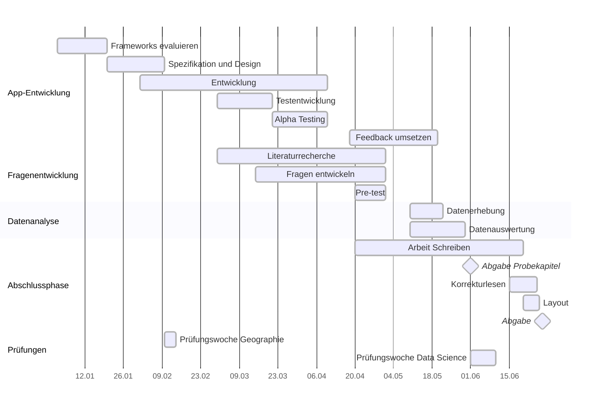

# Designing InterMind


## Abstract

Affektives Wohlbefinden entsteht situativ im Zusammenspiel materieller Umgebungen, sozialer Dynamiken und sozialer Positionierungen. Aus einer intersektionalen, an *affective geographies* orientierten und kritisch-digitalen Perspektive entwickle ich in dieser Arbeit einen Zugang, der nicht nur das \emph{Was} der Erhebung, sondern auch das *Wie* und *Womit* reflektiert. Ziel ist es, ein offenes, nachvollziehbares Setup für wiederholte, kontextnahe Erhebungen zu konzipieren, technisch umzusetzen und in einer explorativen Pilotstudie hinsichtlich seiner Praxistauglichkeit und Dateneignung für intersektionale Mehrebenenanalysen zu prüfen.

Methodisch kombiniere ich (i) eine theoretische Fundierung in Intersektionalität und *affective geographies* mit (ii) einer kritisch-digitalen Anforderungsanalyse (Transparenz, Datensparsamkeit, Nachvollziehbarkeit), (iii) der Entwicklung einer offenen GEMA-Infrastruktur (*InterMind*) und (iv) der Konstruktion eines kompakten Fragebogens für wiederholte \textit{in situ}-Erhebungen. Die Pilotierung demonstriert die prinzipielle Durchführbarkeit des Gesamt-Setups (Erhebung, Aufbereitung und intersektionales Modell) und ermöglicht eine erste Beurteilung von Teilnahmebelastung, Antwortverteilungen und Varianz sowie der Eignung der Datenstruktur für intersektionale Mehrebenenmodellierung (Identifizierbarkeit, Konvergenz, Unsicherheit).

Die Arbeit leistet drei Beiträge: Erstens integriere ich Intersektionalität, *affective geographies* und kritisch-digitale Perspektiven zu einem kohärenten methodischen Rahmen. Zweitens stelle ich mit *InterMind* eine quelloffene, anpassbare und prüfbare Infrastruktur bereit. Drittens liefere ich Evidenz zur Machbarkeit und Grenzen einer intersektional auswertbaren Datenerhebung im Feld. Die Pilotstudie beansprucht keine inhaltlichen Effektschätzungen oder Generalisierungen; sie markiert einen methodischen Ausgangspunkt für weiterführende, grössere Studien -- mit längeren Erhebungsfenstern, diverseren Stichproben und engerer Co-Kreation mit betroffenen Communities.


## Zeitplan




## Latex compile


To use the custom build script, that compiles the document, names it with a timestamp, moves it to the top level directory and moves older versions to the archive, run:

```bash
./build_ba.sh
```

To compile the document with latexmk, run:

```bash
latexmk -pdf -outdir=Arbeit/out -jobname=main Arbeit/main.tex
```

