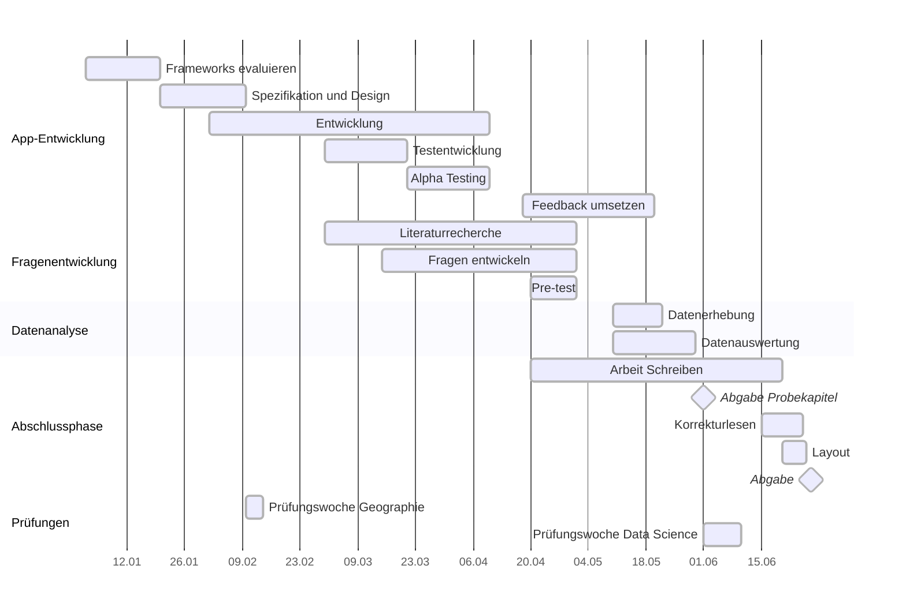

# ba-emotional-city

- [ ] Proposal
  - [X] ~~Erster Draft~~
  - [X] ~~Risikoanalyse~~
  - [ ] Erstellung Fragenkatalog ausführen
  - [X] ~~Zeitplan erstellen~~

---

- [ ] Nächste Termine
  - [X] ~~20.01.2025 07:30 ZOOM mit Moritz Entwurf besprechen~~
  - [X] ~~20.01.2025 14:45 ZOOM mit Caro Betreuung anfragen und Entwurf präsentieren~~
  - [ ] 31.01.2025 08:00 ZOOM mit Moritz Proposal besprechen
  - [ ] 10.04.2025 TBD Besprechung mit Moritz und Caro (nicht 11 - 12:30)
---

# Zeitplan




## Latex compile

```bash
latexmk -verbose -pdf -outdir=Arbeit/out -jobname=main Arbeit/main.tex
```

